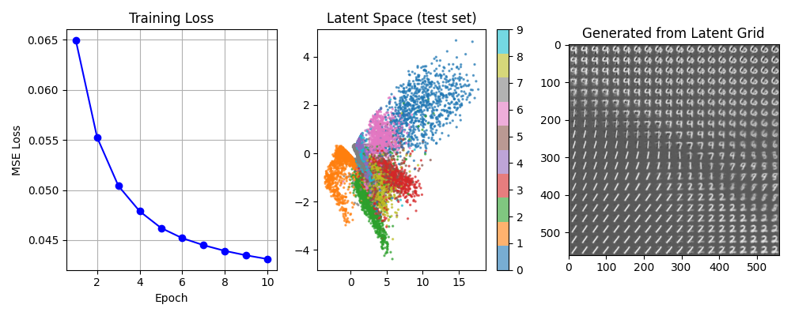

# 03 AutoEncoder MNIST 实验报告

## 一、实验目的

本实验以 MNIST 手写数字数据集为对象，完成基于自编码器（AutoEncoder）的无监督表征学习与图像重建任务。实验的主要目标如下：

1. 掌握自编码器的基本原理，包括编码器-解码器结构与潜在空间表征学习。
3. 结合潜在空间可视化和重建图像，分析模型的学习效果。

## 二、实验环境

- 开发语言：Python 3.12
- 深度学习框架：PyTorch 2.5.1+cu121
- GPU：NVIDIA GeForce RTX 4060 Laptop GPU (8 GB)
- CUDA：12.1 / cuDNN 9.1.0
- 数据集：MNIST

## 三、实验数据与预处理

MNIST 数据集包含 `60000` 张训练图像和 `10000` 张测试图像，每张图像大小为 `28 x 28`，为单通道灰度图像。

数据预处理流程：
1. 使用 `torchvision.datasets.MNIST` 加载数据；
2. 将像素值归一化到 `[0, 1]`，并将图像展平为 `784` 维向量。

本次实验的数据规模为：

- 训练集：60000
- 测试集：10000
- 批大小：256

## 四、模型设计

采用多层全连接网络（MLP）作为编码器和解码器：

- **编码器**：`784 → 128 → 32 → 8 → 2`，每层使用 ReLU 激活，最终将 784 维图像压缩到 2 维潜在空间
- **解码器**：`2 → 8 → 32 → 128 → 784`，每层使用 ReLU 激活，输出层使用 Tanh
- **参数量**：210,562
- **损失函数**：MSE
- **优化器**：Adam (lr=1e-3)

## 五、实验参数设置

- `epochs = 10`
- `batch_size = 256`
- `learning_rate = 1e-3`
- `encoding_dim = 2`
- `seed = 42`

## 六、实验结果

| Epoch | Train Loss (MSE) |
|-------|------------------|
| 1 | 0.064943 |
| 2 | 0.055258 |
| 3 | 0.050410 |
| 4 | 0.047880 |
| 5 | 0.046219 |
| 6 | 0.045199 |
| 7 | 0.044496 |
| 8 | 0.043928 |
| 9 | 0.043484 |
| 10 | 0.043114 |

- **最终 Train Loss**：0.043114
- **Test MSE**：0.042864

**可视化结果：**

从左到右依次为：训练损失曲线、测试集潜在空间分布（按数字类别着色）、潜在空间网格生成结果。

## 七、成果分析

从训练曲线可以观察到，模型在 10 个 epoch 内损失持续下降（0.0649 → 0.0431），收敛过程平稳。

从潜在空间散点图可以看到，不同数字类别在 2D 潜在空间中呈现一定的聚类趋势，说明编码器在没有标签监督的情况下学会了将相似数字映射到相近的潜在向量。

通过对 2D 潜在空间的均匀采样（latent grid），解码器能够生成从一种数字平滑过渡到另一种数字的图像，说明学习到的潜在空间具有连续性和语义意义。

## 八、结论

本实验完成了基于 MNIST 数据集的 MLP AutoEncoder 表征学习与图像重建任务。实验表明：

1. MLP AutoEncoder 能够有效地将高维图像压缩到 2 维潜在空间，Test MSE 达到 0.042864；
2. 2D 潜在空间可视化直观展示了自编码器的聚类能力和连续语义空间特性。
