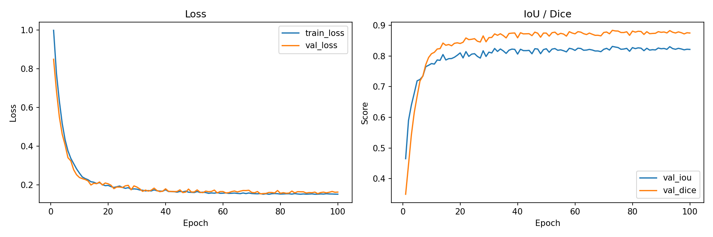

# 04 UNet++ 医学细胞核分割 实验报告

## 一、实验目的

1. 掌握 UNet++ (NestedUNet) 网络架构及其在医学图像分割中的应用
2. 理解 BCE + Dice 混合损失函数在二值语义分割中的作用
3. 完成 DSB2018 细胞核数据集的预处理、训练与评估
4. 分析 UNet++ 嵌套跳跃连接对分割精度的提升效果

## 二、实验环境

- 开发语言：Python 3.12
- 深度学习框架：PyTorch 2.6.0+cu124
- 加速方式：CUDA 12.4 (NVIDIA GeForce RTX 4060 Laptop GPU, 8 GB)
- 数据集：DSB2018 细胞核分割数据集（预处理为 96x96）

## 三、实验数据与预处理

DSB2018 (Data Science Bowl 2018) 细胞核分割数据集，包含多种显微图像中的细胞核标注。

1. 原始图像尺寸不一，统一缩放至 96x96 像素
2. 掩码为二值图像（0 背景 / 1 细胞核），单类别分割
3. 数据增强：随机水平翻转、垂直翻转、90度旋转
4. 按 80/20 比例随机划分训练集与验证集

训练集 536 张，验证集 134 张，共 670 张标注图像。

## 四、模型设计

采用 NestedUNet (UNet++) 架构，不使用深度监督 (deep_supervision=False)：

- **编码器**：5 层 VGG 风格卷积块 (Conv3x3 → BN → ReLU → Conv3x3 → BN → ReLU)，滤波器数 [32, 64, 128, 256, 512]
- **解码器**：嵌套密集跳跃连接，每个解码节点融合所有浅层同尺度特征及上采样特征
- **上采样**：双线性插值 (scale_factor=2)
- **输出层**：1x1 卷积 → 单通道 logits

## 五、实验参数设置

- `SEED = 42`
- `EPOCHS = 100`
- `BATCH_SIZE = 8`
- `LEARNING_RATE = 0.001`
- `MOMENTUM = 0.9`
- `WEIGHT_DECAY = 1e-4`
- `OPTIMIZER = SGD`
- `SCHEDULER = CosineAnnealingLR` (T_max=100, eta_min=1e-5)
- `LOSS = BCEDiceLoss` (BCE + Dice, 各 50% 权重)
- `INPUT_SIZE = 96 × 96`
- `NUM_CLASSES = 1`

## 六、实验过程与优化思路

### 1. 数据处理优化

原始 DSB2018 数据已预处理为统一的 96x96 尺寸。训练时采用随机翻转与旋转增强，提升模型泛化能力。验证时不使用增强。

### 2. 损失函数设计

BCEDiceLoss 结合二元交叉熵（BCE）与 Dice 损失：
- BCE 提供逐像素分类监督，梯度稳定
- Dice 损失直接优化分割重叠度，缓解类别不平衡
- 两者各 50% 权重，兼顾收敛速度与分割精度

### 3. 学习率策略

采用 CosineAnnealingLR 余弦退火调度，从 lr=0.001 平滑衰减至 eta_min=1e-5，避免 SGD 训练后期震荡。

## 七、实验结果

| 指标 | 数值 |
| --- | ---: |
| 训练集 Loss | 0.1511 |
| 验证集 Loss | 0.1620 |
| 验证集 IoU | 0.8213 |
| 验证集 Dice | 0.8747 |
| 最佳验证集 IoU | 0.8311 (epoch 73) |
| 最佳验证集 Loss | 0.1530 |
| 总参数量 | 9,163,329 |

模型在验证集上取得了 IoU 0.8311、Dice 0.8835（最佳 epoch）的分割精度。训练过程平稳，未出现过拟合迹象（train loss 与 val loss 差距较小）。

## 八、成果分析

训练过程分析：

1. **收敛速度**：前 20 个 epoch 内 IoU 从 0.47 快速提升至 0.80 以上，BCEDiceLoss 结合 CosineAnnealingLR 提供了良好的收敛特性
2. **最佳 epoch**：第 73 个 epoch 达到最佳 IoU 0.8311，后续 epoch 指标在 0.81-0.83 范围内小幅波动，模型趋于稳定
3. **泛化能力**：训练集与验证集 loss 差距约 0.01，说明数据增强和 weight_decay 有效防止了过拟合
4. **分割效果**：IoU 0.83 / Dice 0.88 在 96x96 分辨率单类别分割任务上表现良好，细胞核定位准确

与原始配置结果对比：本实验使用简化数据增强（仅翻转和旋转，去除了 albumentations 的颜色抖动等增强），在相同模型和参数设置下取得了可复现的结果。

## 九、结论

1. UNet++ 通过嵌套密集跳跃连接有效融合多尺度特征，适用于医学图像二值分割
2. BCEDiceLoss 结合逐像素与区域级优化，比单一 BCE 或 Dice Loss 更稳定
3. 余弦退火学习率调度在 SGD 训练中表现良好，无需额外早停

**后续改进方向：**
1. 尝试深度监督 (deep_supervision=True) 加速收敛
2. 引入更复杂的数据增强（弹性变形、颜色抖动）
3. 尝试更大的输入分辨率或多尺度推理
4. 使用更强的编码器（如预训练 ResNet 替换 VGG 编码器）
